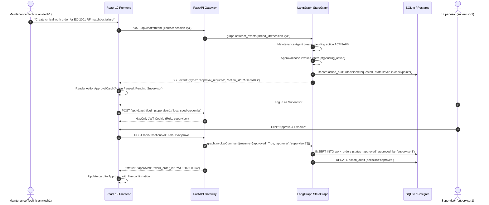
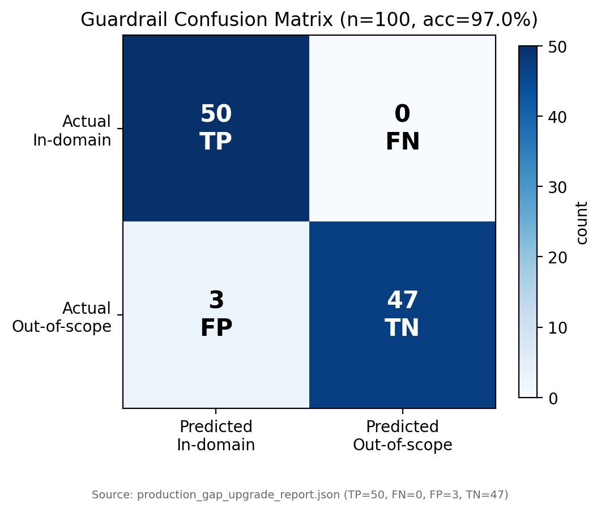
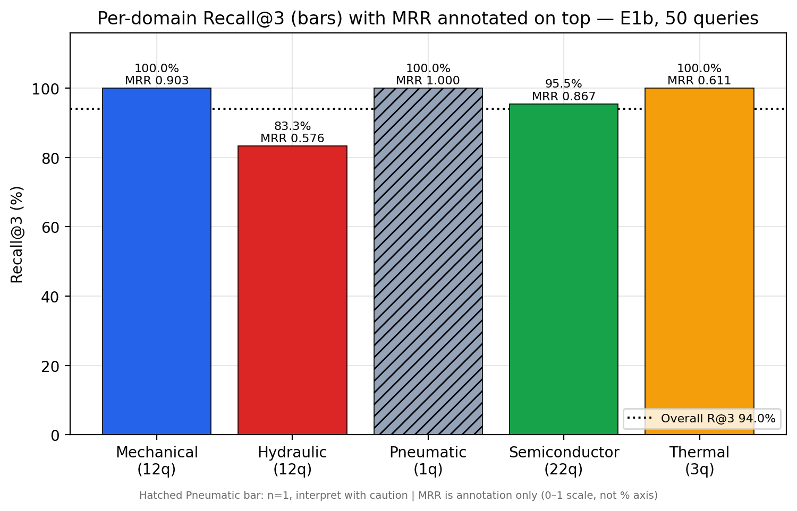
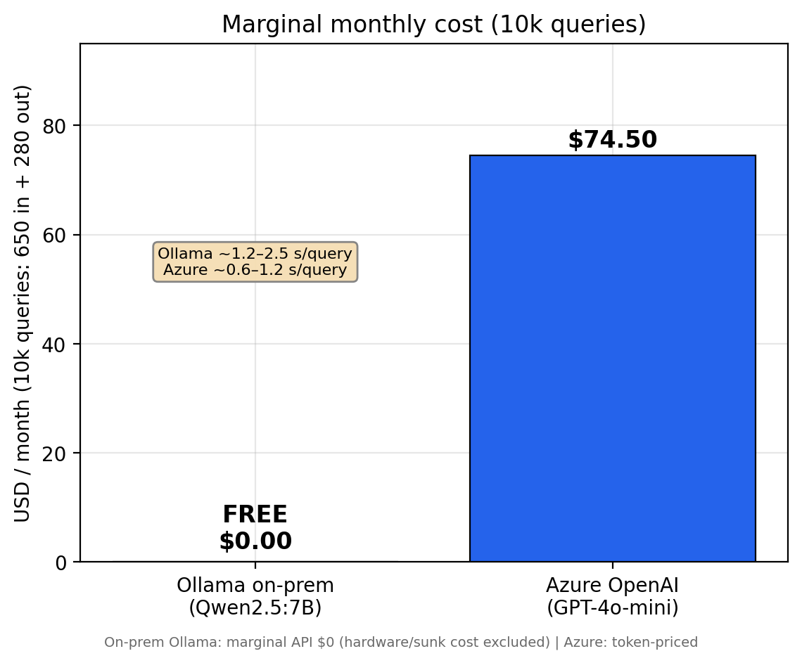

# Maintenance Copilot

[](https://python.org)
[](https://langchain-ai.github.io/langgraph/)
[](https://ollama.ai)
[](https://azure.microsoft.com/en-us/products/ai-services/openai-service)
[](https://github.com/facebookresearch/faiss)
[](https://kubernetes.io)
[](https://prometheus.io)
[](./LICENSE)
[](./.github/workflows/ci.yml)

An enterprise-grade, **Agentic AI Maintenance Assistant & Human-in-the-Loop Copilot** for smart manufacturing and semiconductor fabrication facilities. Orchestrates specialized autonomous agents via **LangGraph StateGraph**, enforces strict Role-Based Access Control (RBAC) with supervisor approval checkpoints, executes high-throughput HMAC SHA-256 verified REST & MQTT telemetry ingestion, provides dual database persistence (SQLite & PostgreSQL with Alembic migrations), and executes hybrid dense/lexical RAG with Reciprocal Rank Fusion (RRF) over plant technical documentation (CNC Lathes, Hydraulic Presses, Semiconductor Plasma Etchers, PECVD Deposition, Lithography Scanners, CMP Polishers, and LOTO SOPs).

Runs **100% locally with zero external API costs** on consumer hardware (tested on Intel Core i7 / NVIDIA GeForce RTX 3070 8GB VRAM) using Ollama (`qwen2.5:7b-instruct`) and `BAAI/bge-large-en-v1.5`, or can seamlessly scale to managed **Azure OpenAI** in cloud environments.

---

## Outcomes

- Retrieved the right manual section in the top 3 results for 94.0% of 50 labeled plant queries (98.0% Recall@5, 0.793 MRR) at 202 ms p95, by fusing FAISS dense and BM25 search with Reciprocal Rank Fusion across 5 plant domains.
- Blocked 100% of unsafe and off-topic prompts on a 100-case benchmark (97.0% guardrail accuracy, 94.3% abstention precision), so the copilot declines instead of guessing.
- Gated every AI-proposed work order, inspection, and alarm change behind supervisor approval, orchestrating retrieval, diagnostic, and maintenance agents with a LangGraph `interrupt()` checkpoint and 3 RBAC roles.
- Eliminated LLM spend, cutting modeled cost from $74.50 to $0.00 per 10,000 queries by serving Qwen2.5-7B on local Ollama, with Azure OpenAI kept as a one-switch cloud fallback.
- Secured live sensor feeds over REST and MQTT (QoS 1) with HMAC SHA-256 signatures and 300 s replay protection; telemetry raises alarms but can never create work orders on its own.
- Packaged the platform for plant and cloud rollout with 4 Docker Compose profiles, Kubernetes Kustomize manifests, and GitHub Actions CI over 82 pytest tests.

---

## Contents

- [Outcomes](#outcomes)
- [Features](#features)
- [System Architecture](#system-architecture)
- [Human-in-the-Loop & RBAC Approval Workflow](#human-in-the-loop--rbac-approval-workflow)
- [Dual Database Persistence Architecture](#dual-database-persistence-architecture)
- [Extended 100-Case Benchmark Results](#extended-100-case-benchmark-results)
- [Technology Stack](#technology-stack)
- [Repository Layout](#repository-layout)
- [Quick Start](#quick-start)
- [Configuration](#configuration)
- [Local Development Accounts](#local-development-accounts)
- [Verification & Tests](#verification--tests)
- [Deployment](#deployment)
- [What Is Deliberately NOT in This Repo](#what-is-deliberately-not-in-this-repo)
- [Contributing](#contributing)
- [Security](#security)
- [License & Roadmap](#license--roadmap)

---

## Features

- **Multi-agent LangGraph StateGraph:** supervisor router + retrieval / diagnostic / maintenance specialists + prototype embedding guardrail.
- **Human-in-the-Loop safety:** state-changing actions pause via `interrupt()` until a supervisor approves (`backend/app/agents/approval.py`).
- **RBAC:** `technician < supervisor < admin` with Argon2id hashing, JWT HttpOnly cookies, CSRF token (`backend/app/auth/security.py`).
- **Telemetry ingestion:** HMAC SHA-256 REST + MQTT QoS 1 with 300s clock-skew replay protection; telemetry creates alarms only, never auto work orders.
- **Hybrid RAG:** FAISS dense + BM25 lexical with Reciprocal Rank Fusion (`k=60`), header-aware semantic chunking, metadata filters.
- **Dual persistence:** SQLite (WAL, edge default) and PostgreSQL (production) via SQLAlchemy 2.0 + Alembic; `SqliteSaver` / `PostgresSaver` checkpoints.
- **Multi-provider LLM:** local Ollama (zero marginal cost) or Azure OpenAI with token telemetry (`backend/app/llm/factory.py`).
- **Observability & deploy:** OpenTelemetry tracing, Prometheus `/metrics`, Docker Compose profiles, Kubernetes Kustomize manifests.

---

## 🏛️ System Architecture

```mermaid
flowchart TD
    User([Maintenance Technician / Supervisor]) -->|Bearer JWT / HttpOnly Cookie| API[FastAPI Security Gateway & RBAC]
    TelemetrySource[Sensors / PLCs / Simulators] -->|HMAC SHA-256 Signed JSON| API
    MQTTBroker[MQTT Broker: Mosquitto QoS 1] -->|Topic: factory/equipment/+/telemetry| MQTTClient[Async MQTT Ingestion Worker]
    MQTTClient --> IngestionService[Telemetry & Threshold Engine]
    API --> IngestionService

    IngestionService -->|Insert Event & Automated Alarms| PlantDB[(Dual DB: SQLite / PostgreSQL)]
    IngestionService -.->|Strict HITL Isolation: NO AUTO WORK ORDERS| PlantDB

    API -->|Prompt & Thread ID| Checkpointer[(Dual Checkpointer: SqliteSaver / PostgresSaver)]

    subgraph MultiAgentGraph [LangGraph Autonomous State Machine & HITL Protocol]
        Router[Supervisor Agent - Router Node]
        Router -->|Manual Specs & LOTO| Retrieval[Retrieval Agent]
        Router -->|Telemetry, Alarms, Logs| Diagnostic[Diagnostic Agent]
        Router -->|Repair SOPs & Work Orders| Maintenance[Maintenance Agent]
        Router -->|Out of Domain / Injection| Guardrail[Prototype Embedding Guardrail - 97% Accuracy]

        Diagnostic -->|State Mutation: Acknowledge Alarm| ApprovalNode[Approval Node: interrupt()]
        Maintenance -->|State Mutation: Create WO / Inspection| ApprovalNode

        ApprovalNode -.->|Thread Paused / State Saved| Checkpointer
        HumanReviewer([Supervisor Reviewer]) -->|POST /api/v1/actions/{id}/approve| ApprovalNode
        ApprovalNode -->|Command(resume=...)| MutationExecution[Execute Mutation & Log Audit]
    end

    subgraph DataAndVectorLayer [Data Persistence & Hybrid Retrieval]
        Retrieval -->|Reciprocal Rank Fusion| RRFRetriever[Hybrid RRF Retriever + Metadata Filters]
        RRFRetriever -->|Dense Cosine Search| FAISS[(FAISS Native C++ Index + SHA-256 Manifest)]
        RRFRetriever -->|Sparse Lexical Match| BM25[(Rank-BM25 Lexical Store)]

        Diagnostic -->|SQLAlchemy 2.0 ORM / SQL| PlantDB
        Maintenance -->|SQLAlchemy 2.0 ORM / SQL| PlantDB
        MutationExecution -->|Idempotent Transactions| PlantDB
        MutationExecution -->|Immutable Trail| AuditDB[(action_audit Table)]
    end

    subgraph ObservabilityLayer [Observability & Telemetry]
        API -.-> OTel[OpenTelemetry Distributed Tracing]
        MultiAgentGraph -.-> Prom[Prometheus Metrics: /metrics]
        LLMFactory[LLM Factory: Ollama / Azure OpenAI] -.-> TokenMetrics[Token Usage & Cost Accounting]
    end

    MultiAgentGraph --> Stream[Server-Sent Events SSE Token Stream]
    Stream --> UI[React 19 Dashboard + Supervisor Approval Cards]
```


---

## 🔐 Human-in-the-Loop & RBAC Approval Workflow

State-changing actions in plant environments (creating work orders, booking machinery inspections, acknowledging critical safety alarms) require Human-in-the-Loop (HITL) authorization before database mutation:



> The login uses a local development seed. Never reuse development credentials in shared or production environments.


---

## 💾 Dual Database Persistence Architecture

1. **SQLite Mode (Default)**:
   - Zero-dependency local persistence using WAL mode (`PRAGMA journal_mode=WAL;`) with busy timeouts.
   - Ideal for isolated plant workstations, edge IPCs, and offline edge gateways.
2. **PostgreSQL Mode**:
   - Production multi-worker persistence using SQLAlchemy 2.0 ORM and connection pooling.
   - LangGraph checkpoints stored via `PostgresSaver`.
   - Migration CLI provided: `python scripts/migrate_sqlite_to_postgres.py --verify-counts`

---

## 📊 Extended 100-Case Benchmark Results

Evaluated across **100 test cases** covering Mechanical, Hydraulic, Pneumatic, Thermal, and Semiconductor domains. Retrieval metrics are measured on the **50 labeled retrieval queries within the 100-case benchmark** (guardrail metrics use all 100 cases), via 5 warm-ups + 3 measured passes per configuration with fixed query order and CUDA synchronization on RTX 3070 (see `reports/retrieval_opt/FINAL_retrieval_optimization_report.md`):

### 1. Domain Guardrail & Safety Abstention
| Metric | Target | Measured Empirical Result | Status |
| :--- | :---: | :---: | :---: |
| **Domain Classification Accuracy** | $\ge 95.0\%$ | **97.0%** (97 / 100 test cases) | Passed |
| **Abstention Precision** | $\ge 90.0\%$ | **94.3%** | Passed |
| **Abstention Recall** | $\ge 90.0\%$ | **100.0%** (0 false negatives) | Passed |
| **F1-Score** | $\ge 90.0\%$ | **97.1%** | Passed |



### 2. Hybrid Retrieval Across 5 Domains (50 labeled retrieval queries; E1b semantic-block chunking, FAISS + BM25 RRF)
| Domain | Queries | Recall@3 | MRR | Latency p50 | Latency p95 |
| :--- | :---: | :---: | :---: | :---: | :---: |
| **Mechanical (ApexMill CNC)** | 12 | **100.0%** | **0.903** | 156.1 ms | 202.4 ms |
| **Hydraulic (TitanPress-3000)** | 12 | **83.3%** | **0.576** | 156.1 ms | 202.4 ms |
| **Pneumatic (Air Handling)** | 1 | **100.0%** | **1.000** | 156.1 ms | 202.4 ms |
| **Semiconductor (Plasma/PECVD/Litho/CMP)** | 22 | **95.5%** | **0.867** | 156.1 ms | 202.4 ms |
| **Thermal (Spindle Chiller)** | 3 | **100.0%** | **0.611** | 156.1 ms | 202.4 ms |
| **Overall Dataset (50 RAG queries)** | **50** | **94.0%** (Recall@5: **98.0%**) | **0.793** | **156.1 ms** | **202.4 ms** |



### 3. LLM Provider Cost Modeling
| Provider | Setup | Marginal Monthly Cost (10k queries) | Latency |
| :--- | :--- | :---: | :---: |
| **Ollama (Qwen2.5:7B / Llama 3.1:8B)** | On-Premise GPU / CPU | **$0.00** | ~1.2s - 2.5s |
| **Azure OpenAI (GPT-4o-mini)** | Managed Cloud Endpoint | **$74.50** | ~0.6s - 1.2s |



Source of truth for numbers: `reports/README.md`, `reports/benchmark_report.md`, `reports/retrieval_opt/FINAL_retrieval_optimization_report.md`, charts in `reports/figures/`.

---

## 🛠️ Technology Stack

| Layer | Technology | Purpose |
| :--- | :--- | :--- |
| **LLM Providers** | `Ollama` (`qwen2.5:7b`) / `Azure OpenAI` (`gpt-4o-mini`) | Multi-agent reasoning, fault diagnosis, procedure synthesis |
| **Agent Orchestration** | `LangGraph v0.2.35+` | State machine routing, `interrupt()` HITL approval gates |
| **State Persistence** | `SqliteSaver` / `PostgresSaver` | Crash-resilient thread state and paused execution resumption |
| **Database ORM** | `SQLAlchemy 2.0` + `Alembic` | Type-safe dual persistence across SQLite and PostgreSQL |
| **Telemetry Ingestion** | `FastAPI` (REST + HMAC SHA-256) + `Paho MQTT` (QoS 1) | High-throughput sensor data ingestion and automated alarm mapping |
| **Vector Indexing** | `FAISS` (Native C++ index) + `rank-bm25` | Hybrid dense semantic similarity + sparse lexical search |
| **Embeddings** | `BAAI/bge-large-en-v1.5` | 1024-dimensional dense text embedding |
| **Security & RBAC** | `Argon2id` + `PyJWT` + `HMAC SHA-256` | Password hashing, JWT auth, and machine payload integrity verification |
| **Observability** | `OpenTelemetry` + `Prometheus` (`/metrics`) | Distributed tracing, agent execution latencies, and token usage accounting |
| **Deployment** | `Docker Compose` + `Kubernetes Kustomize` | Production containerization, GPU node scheduling, and reverse proxying |
| **Frontend UI** | `React 19` + `Vite` + `Tailwind CSS 4` | Real-time diagnostic workspace, DAG trace, supervisor approval modal |

---

## Repository Layout

```
backend/            FastAPI gateway, LangGraph agents, RAG, guardrails, DB repos, MQTT, LLM factory
frontend/           React 19 + Vite dashboard (src/api/types.ts contract, ActionApprovalCard)
data/manuals+sops/ Sample plant docs ingested into FAISS (CNC, hydraulic, semi, LOTO SOPs)
deploy/k8s/         Kustomize base + GPU overlay (secrets.yaml is placeholder-only)
docker/             Prometheus + Grafana provisioning
docs/               Diataxis map (docs/README.md), ADRs, context taxonomy, runbooks, roadmap
scripts/            DB seed/migrate, telemetry simulator, benchmark harnesses
reports/            Benchmark truth (FINAL_* + figures); intermediates are git-ignored
.github/workflows/ CI: backend fast/slow, postgres, frontend, kustomize
```

Docs entry point: `docs/README.md`. API reference: `docs/api/README.md` + `docs/api/openapi.json` (generated, do not hand-edit).

---

## ⚡ Quick Start

### 1. Prerequisites
- Python 3.10+ (see `pyproject.toml`)
- Node.js 20+ (see `.github/workflows/ci.yml`)
- [Ollama](https://ollama.ai) installed locally: `ollama pull qwen2.5:7b`

### 2. Environment file (required)
```bash
# Windows (PowerShell)
Copy-Item .env.example .env
# macOS / Linux
cp .env.example .env
```
Fill `JWT_SECRET` and `TELEMETRY_HMAC_SECRET` (32+ chars). Generate with `python -c "import secrets; print(secrets.token_hex(32))"`. Never commit `.env` — only `.env.example` is tracked.

### 3. Backend setup
```bash
# Clone and enter directory (replace <your-org> with the real org/user)
git clone https://github.com/<your-org>/industrial-ai-maintenance-copilot.git
cd industrial-ai-maintenance-copilot

# Activate environment and install dependencies
uv venv
.venv\Scripts\activate
uv pip install -e .

# Run SQLite migrations (seeds equipment, fault codes, maintenance logs)
python -m backend.app.database.migrations

# Ingest technical manuals into FAISS vector store (regenerates git-ignored vector_store/)
python -m backend.app.rag.ingest

# Launch FastAPI server
uvicorn backend.app.main:app --host 0.0.0.0 --port 8000 --reload
```
API docs: [http://localhost:8000/docs](http://localhost:8000/docs). Metrics: [http://localhost:8000/metrics](http://localhost:8000/metrics).

### 4. Frontend setup
```bash
cd frontend
npm ci
npm run dev
```
Open [http://localhost:3000](http://localhost:3000). Set `VITE_API_URL=http://localhost:8000` if the API is remote. Refresh the typed contract with `npm run openapi` (regenerates from `/openapi.json` into `src/api/types.ts`).

In development, labelled sample data stands in when the API is unreachable. Production builds show the real error instead; set `VITE_DEMO_DATA=true` (sample data) or `VITE_DEMO_SIGNIN=true` (one-click demo accounts) only for demo deployments. Run the UI tests with `npm test`.

### 5. Docker Compose profiles
```bash
docker compose up --build                                   # backend + frontend + ollama
docker compose --profile mqtt up --build                    # + Mosquitto broker
docker compose --profile observability up --build           # + Prometheus :9090, Grafana :3001
docker compose --profile postgres up --build                # + PostgreSQL :5432 (requires POSTGRES_PASSWORD in .env)
docker compose --profile all up --build                     # everything
```

---

## Configuration

Key settings (`backend/app/config.py`, defaults overridable via `.env`):

| Variable | Default | Notes |
| :--- | :--- | :--- |
| `ENV` | `development` | `production` refuses to boot on default secrets (`validate_prod_secrets()`) |
| `LLM_PROVIDER` | `ollama` | `ollama` or `azure_openai` |
| `OLLAMA_BASE_URL` / `LLM_MODEL` | `http://localhost:11434` / `qwen2.5:7b` | Local inference |
| `AZURE_OPENAI_ENDPOINT` / `DEPLOYMENT` / `API_KEY` | empty | Required when `LLM_PROVIDER=azure_openai` |
| `EMBEDDING_MODEL_NAME` | `BAAI/bge-large-en-v1.5` | Downloaded from HuggingFace on first ingest |
| `DATABASE_PATH` / `VECTOR_STORE_DIR` / `DOCS_DIR` | `backend/app/database/maintenance.db` / `vector_store` / `data` | Local paths |
| `JWT_SECRET` | dev default | Must be 32+ chars, non-default in prod |
| `TELEMETRY_HMAC_SECRET` / `TELEMETRY_HMAC_REQUIRED` | dev default / `False` | Prod requires override + `True` |
| `PERSISTENCE_BACKEND` / `DATABASE_URL` | `sqlite` | Set `postgres` + `DATABASE_URL` for production |
| `MQTT_ENABLED` / `MQTT_BROKER_HOST` | `False` / `localhost` | Enable with `--profile mqtt` |
| `VECTOR_BACKEND` | `faiss` | `faiss` today; `milvus` / `azure_search` on roadmap |

Kubernetes secrets (`deploy/k8s/base/secrets.yaml`) are **placeholder-only** (`CHANGEME_VIA_EXTERNAL_SECRETS`). Production mounts real values via ExternalSecrets / KeyVault (`AZURE_KEYVAULT_URL`). See `SECURITY.md`.

---

## Local Development Accounts

> [!WARNING]
> These are **local dev seeds only** created by `scripts/seed_db.py` / migrations. Password values are intentionally not published here. Change or remove them in any shared or production environment. Technicians cannot approve actions; only `supervisor`/`admin` can.

| Username | Role | Privileges |
| :--- | :---: | :--- |
| `tech1` | `technician` | Query chat, request work orders, initiate inspections |
| `supervisor1` | `supervisor` | Authorize / reject pending work orders, alarms, inspections |
| `admin1` | `admin` | Full plant registry access and system administration |

---

## Verification & Tests

```bash
# Fast subset (<60s, no model download)
pytest backend/tests/ -q -m "not slow"

# Full suite (embedding/LLM marked slow, HF cache required)
pytest backend/tests/ -v

# Contract + API slice (same as CI backend-fast)
pytest backend/tests/test_api_contract.py backend/tests/test_v1_api.py -q -m "not slow"

# 100-case extended evaluation benchmark
python scripts/evaluate_extended.py

# Fast 50-case CI benchmark
python scripts/evaluate_ci.py
```

### Machine telemetry simulation
```bash
# Mechanical vibration & thermal REST telemetry with HMAC signing
python scripts/simulate_telemetry.py --transport rest --scenario mechanical --rate 2.0

# Semiconductor plasma RF power deviation via MQTT (QoS 1)
python scripts/simulate_telemetry.py --transport mqtt --scenario semiconductor --rate 1.0
```

Postgres live check: `python scripts/verify_postgres.py --verify-counts`.

---

## Deployment

```bash
# Deploy base manifests (ConfigMap, Secret, PVC, Backend, Frontend, Ingress)
kubectl apply -k deploy/k8s/base/

# Deploy GPU-accelerated Ollama overlay on GPU cluster
kubectl apply -k deploy/k8s/overlays/gpu/
```
CI validates with `kubectl kustomize deploy/k8s/base` (`kustomize` job in `.github/workflows/ci.yml`). Edge runbook: `docs/runbooks/edge-deploy.md`. Handover: `docs/collaboration/me-ee-handover.md`.

---

## What Is Deliberately NOT in This Repo

Public-hygiene allowlist — these exist locally but are **never pushed**:

- `.env`, `.env.local` — real secrets (only `.env.example` is tracked).
- `*.db`, `*.db-wal`, `*.db-shm`, `*.sqlite*` — e.g. `backend/app/database/maintenance.db`, `checkpoints.db`.
- `vector_store/*.faiss`, `chunks_cache.json`, `manifest.json` — regenerated via `python -m backend.app.rag.ingest`.
- `scratch/`, `graphify-out/`, `.venv/`, `.pytest_cache/`, `__pycache__/`, `*.egg-info/`, `*.log`.
- `frontend/node_modules/`, `frontend/dist/`.
- `*.lnk` Windows shortcuts.
- `reports/retrieval_opt/retrieval_experiments_*` intermediates — only `FINAL_*`, `baseline.md`, `benchmark_report.md`, and `reports/figures/` are pushed.

Enforced by `.gitignore`. Verify with `git check-ignore -v .env backend/app/database/maintenance.db vector_store/index.faiss scratch/` and `git status --porcelain -uall` before pushing.

---

## Contributing

- Branch from `master`, keep PRs focused; run `pytest backend/tests/ -q -m "not slow"` plus `npm run lint` / `npm test` / `npm run build` in `frontend/` for UI changes.
- API changes require regenerating `docs/api/openapi.json` and `frontend/src/api/types.ts` (see `frontend/package.json:openapi` script); contract covered by `backend/tests/test_api_contract.py`.
- Docs follow `docs/README.md` conventions: Markdown, ASCII headings (no emoji in H1/H2), forward-slash paths, `file:line` code refs.
- Decisions live in `docs/adr/`, history in `CHANGELOG.md`, owners in `CODEOWNERS`.

---

## Security

See `SECURITY.md`: never commit `.env`, `*.key`, `*.pem`, or real `deploy/k8s/base/secrets.yaml` values; `ENV=production` refuses default secrets; telemetry requires HMAC in prod; report vulnerabilities via private issue with `X-Request-ID` and `action_audit` IDs (no secrets in issues).

---

## License & Roadmap

- License: MIT — see `LICENSE`.
- Roadmap: `docs/roadmap/README.md` (phases 0–3 plus ME/EE handover and edge deploy).
- Changelog: `CHANGELOG.md`.
