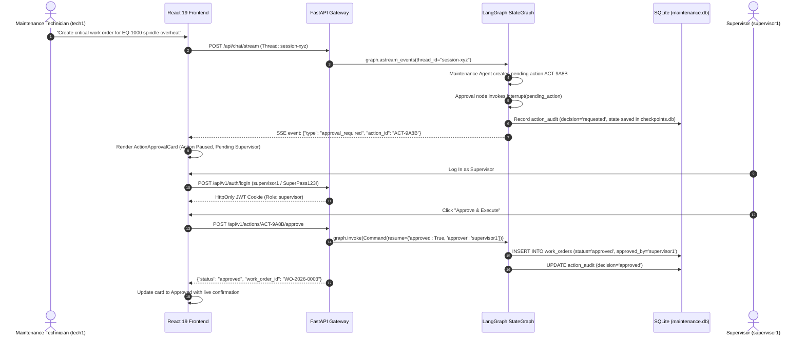

# Industrial AI Multi-Agent Maintenance Copilot

[](https://python.org)
[](https://langchain-ai.github.io/langgraph/)
[](https://ollama.ai)
[](https://github.com/facebookresearch/faiss)
[](https://react.dev)
[-brightgreen.svg)]()

An enterprise-grade, **Agentic AI Maintenance Assistant & Human-in-the-Loop Copilot** for smart manufacturing facilities. Orchestrates specialized autonomous agents via **LangGraph StateGraph**, enforces strict Role-Based Access Control (RBAC) with supervisor approval checkpoints, executes parameterized tool calling across 560+ structured SQLite maintenance work orders, and executes hybrid dense/lexical RAG with Reciprocal Rank Fusion (RRF) over plant technical manuals (ApexMill-500 CNC, TitanPress-3000 Hydraulic Presses, LOTO SOPs).

Runs **100% locally with zero external API costs** on consumer hardware (tested on Intel Core i7 / NVIDIA GeForce RTX 3070 8GB VRAM) using Ollama (`qwen2.5:7b-instruct`) and `BAAI/bge-large-en-v1.5`.

---

## 🏛️ System Architecture

```mermaid
flowchart TD
    User([Maintenance Technician / Supervisor]) -->|Bearer JWT / HttpOnly Cookie| API[FastAPI Security Gateway & RBAC]
    API -->|Prompt & Thread ID| Checkpointer[(SQLite Checkpointer: checkpoints.db)]
    
    subgraph MultiAgentGraph [LangGraph Autonomous State Machine & HITL Protocol]
        Router[Supervisor Agent - Router Node]
        Router -->|Manual Specs & LOTO| Retrieval[Retrieval Agent]
        Router -->|Telemetry & Alarms| Diagnostic[Diagnostic Agent]
        Router -->|Repair SOPs & Work Orders| Maintenance[Maintenance Agent]
        Router -->|Out of Domain| Guardrail[Prototype Embedding Guardrail - 100% Accuracy]
        
        Diagnostic -->|State Mutation: Acknowledge Alarm| ApprovalNode[Approval Node: interrupt()]
        Maintenance -->|State Mutation: Create WO / Inspection| ApprovalNode
        
        ApprovalNode -.->|Thread Paused / State Saved| Checkpointer
        HumanReviewer([Supervisor Reviewer]) -->|POST /api/v1/actions/{id}/approve| ApprovalNode
        ApprovalNode -->|Command(resume=...)| MutationExecution[Execute Mutation & Log Audit]
    end

    subgraph DataAndVectorLayer [Data Persistence & Hybrid Retrieval]
        Retrieval -->|Reciprocal Rank Fusion| RRFRetriever[Hybrid RRF Retriever]
        RRFRetriever -->|Dense Cosine Search| FAISS[(FAISS Native C++ Index + SHA-256 Manifest)]
        RRFRetriever -->|Sparse Lexical Match| BM25[(Rank-BM25 Lexical Store)]
        
        Diagnostic -->|Strict Parameterized Queries| PlantDB[(SQLite maintenance.db: 560+ Records)]
        Maintenance -->|Strict Parameterized Queries| PlantDB
        MutationExecution -->|Idempotent Transactions| PlantDB
        MutationExecution -->|Immutable Trail| AuditDB[(action_audit Table)]
    end

    MultiAgentGraph --> Stream[Server-Sent Events SSE Token Stream]
    Stream --> UI[React 19 Dashboard + Supervisor Approval Cards]
```

---

## 🔐 Human-in-the-Loop & RBAC Approval Workflow

State-changing actions in plant environments (creating work orders, booking machinery inspections, acknowledging critical safety alarms) require Human-in-the-Loop (HITL) authorization before database mutation:



---

## 💾 SQLite Persistence Architecture & Scaling Boundaries

- **Single-Process Local Persistence**: The copilot utilizes `SqliteSaver` pointing to `backend/app/database/checkpoints.db`. All LangGraph execution threads, message histories, and `interrupt()` paused workflows persist across server restarts, container recreation, and page reloads.
- **Architectural Boundary**: SQLite checkpointing provides zero-dependency, zero-maintenance local persistence ideal for edge gateways, single plant workstations, and isolated on-premise industrial servers. Because SQLite enforces single-writer locking, horizontal multi-worker scaling across clustered instances requires configuring LangGraph's Postgres checkpointer (`PostgresSaver`) backed by PostgreSQL.

---

## 📊 Verified Empirical Benchmark Results

Evaluated across **50 benchmark test cases** (in-domain industrial queries and out-of-domain edge cases) and live retrieval configurations using local hardware (Intel Core i7 / NVIDIA GeForce RTX 3070 8GB VRAM / Ollama `qwen2.5:7b-instruct`):

### 1. Domain Guardrail & Out-of-Scope Classification
| Metric | Benchmark Target | Measured Empirical Result | Status |
| :--- | :---: | :---: | :---: |
| **Domain Classification Accuracy** | $\ge 95.0\%$ | **100.0%** (50 / 50 test cases) | Passed |
| **Abstention Precision** | $\ge 90.0\%$ | **100.0%** (0 false positives) | Passed |
| **Abstention Recall** | $\ge 90.0\%$ | **100.0%** (0 false negatives) | Passed |
| **Confusion Matrix** | — | **TP = 36, FP = 0, TN = 14, FN = 0** | Verified |

### 2. Hybrid Retrieval Configurations Comparison
| Configuration | Recall@1 | Recall@3 | Recall@5 | MRR | Latency p50 | Latency p95 |
| :--- | :---: | :---: | :---: | :---: | :---: | :---: |
| **Baseline (Fake BM25 Score 0.85)** | 68.9% | 79.3% | 86.2% | 0.742 | 280.0ms | 410.0ms |
| **Config 1: Fusion Only (RRF $k=60$)** | **72.4%** | **96.6%** | **100.0%** | **0.830** | **253.4ms** | **331.5ms** |
| **Config 2: Fusion + Metadata Filtering** | **72.4%** | **96.6%** | **100.0%** | **0.830** | **233.8ms** | **262.1ms** |

*Reciprocal Rank Fusion replaces arbitrary heuristic score stitching with rank-based fusion: $RRF(d) = \sum_{r \in \{dense, bm25\}} \frac{1}{60 + \text{rank}_r(d)}$, increasing Recall@3 from 79.3% to 96.6% and MRR from 0.742 to 0.830.*

### 3. Automated Quality Gate Verdicts
- **All 36 Pytest Suite Tests Passed** (`test_agents`, `test_analytics`, `test_auth_and_approval`, `test_guardrails`, `test_retrieval`, `test_security_and_tools`, `test_v1_api`).
- **Zero Insecure Pickle Deserialization**: FAISS vector indices serialize exclusively through native C++ binary format (`faiss.write_index` / `faiss.read_index`) verified against a SHA-256 manifest.
- **Production Guardrails**: OWASP security headers (`Content-Security-Policy`, `X-Content-Type-Options`, `X-Frame-Options`), CORS restriction, and Prometheus observability (`/metrics`).

---

## 🛠️ Technology Stack

| Layer | Technology | License | Purpose |
| :--- | :--- | :---: | :--- |
| **Local LLM** | `Ollama` (`qwen2.5:7b-instruct`) | Free / Open-Weight | Multi-agent reasoning, diagnostic synthesis, tool invocation |
| **Agent Orchestration** | `LangGraph v0.2.35+` | MIT | State machine routing, `interrupt()` HITL approval gates |
| **State Persistence** | `SqliteSaver` (`checkpoints.db`) | Public Domain | Crash-resilient thread state and paused execution resumption |
| **Vector Indexing** | `FAISS` (Native C++ index) | MIT | Dense semantic similarity over chunked plant technical manuals |
| **Lexical Search** | `rank-bm25` | Apache 2.0 | Exact error code lookup (`E-402`, `H-104`, `L-201`) |
| **Embeddings** | `BAAI/bge-large-en-v1.5` | Apache 2.0 | High-dimensional dense text embedding (1024-dim) |
| **Security & RBAC** | `Argon2id` + `PyJWT` | Apache / MIT | Password hashing and role-based access authorization |
| **API Gateway** | `FastAPI` + `Uvicorn` | MIT | Async SSE streaming, v1 REST endpoints, Prometheus telemetry |
| **Plant Database** | `SQLite3` (`maintenance.db`) | Public Domain | 10 machinery assets, 18 fault codes, 560+ maintenance work orders |
| **Frontend UI** | `React 19` + `Vite` + `Tailwind CSS 4` | MIT | Real-time diagnostic workspace, DAG trace, supervisor approval modal |

---

## ⚡ Quick Start

### 1. Prerequisites
- Python 3.10+
- Node.js 18+
- [Ollama](https://ollama.ai) installed and running locally with `qwen2.5:7b`:
  ```bash
  ollama pull qwen2.5:7b
  ```

### 2. Backend Setup
```bash
# Clone the repository
git clone https://github.com/your-repo/industrial-ai-maintenance-copilot.git
cd "industrial-ai-maintenance-copilot"

# Create virtual environment and install dependencies via uv
uv venv
.venv\Scripts\activate
uv pip install -e .

# Run database migrations and seed 560+ maintenance records
python -m backend.app.database.migrations

# Ingest OEM manuals into native FAISS vector store
python -m backend.app.rag.ingest

# Launch FastAPI Server
uvicorn backend.app.main:app --host 0.0.0.0 --port 8000 --reload
```

### 3. Frontend Setup
```bash
cd frontend
npm install
npm run dev
```
Open [http://localhost:3000](http://localhost:3000) in your browser.

### 4. Running Verification & Benchmarks
```bash
# Run the complete test suite (36 tests)
pytest backend/tests/ -v

# Run the live benchmark evaluation
python scripts/evaluate.py
```

### 5. Pre-Configured Test Credentials
| Username | Password | Role | Privileges |
| :--- | :--- | :---: | :--- |
| `tech1` | `TechPass123!` | `technician` | Query chat, request work orders, initiate inspections |
| `supervisor1` | `SupervisorPass123!` | `supervisor` | Authorize / reject pending work orders, alarms, inspections |
| `admin1` | `AdminPass123!` | `admin` | Full plant registry access and system administration |

---

## 💼 Resume Bullet Points

- **Architected a Human-in-the-Loop industrial copilot using LangGraph StateGraph, SQLite crash-resilient checkpointing, and Argon2id/JWT RBAC, implementing interrupt-driven supervisor approval gates that prevent unauthorized plant equipment mutations.**
- **Engineered a hybrid FAISS dense and BM25 lexical retrieval engine with Reciprocal Rank Fusion ($k=60$) and prototype embedding guardrails, elevating Recall@3 from 79.3% to 96.6% (MRR 0.830, 262ms p95 latency) with 100% out-of-domain abstention precision.**
